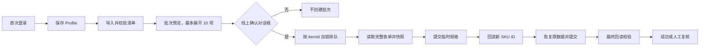

# 天猫运营工作台 PRD

## 1. 文档信息

| 项目 | 内容 |
|---|---|
| 产品名称 | 天猫运营工作台 |
| 版本 | v0.1.29 |
| 目标平台 | Windows 10/11 |
| 产品形态 | Tauri 2 桌面工作台，Vue 3 + TypeScript 应用模块，Node.js + Playwright Worker |
| 需求状态 | v0.1.29 修复历史商品 `channelOption=5` 或空值导致新增花型写前校验失败的问题：旧值零写入阻断，任务要求运营显式选择现代渠道 `1/2`，Worker 在新鲜 bootstrap 上复核后才允许重试。v0.1.28 的 Windows Worker 生命周期与升级修复继续保留。 |

## 2. 背景与问题

商品规格的历史 SKU ID 可能被平台记录最低价。运营需要在保留原规格、价格、库存、商家编码、条码和图片的前提下，重建一组新的 SKU，并在几十个 SKU/多个商品上重复执行。纯手工操作耗时、容易漏填或误提交；直接复制浏览器 Cookie 又会造成凭据风险。

SKU 重建和按表新增花型是当前两个商品 SKU 工作流。v0.1.29 保持稳定的桌面壳和两个应用模块，保留 v0.1.28 的安装/进程生命周期修复，并为平台升级前遗留的销售渠道值增加显式、可审计的人工迁移流程。

本产品使用系统 Edge 的应用专属 Profile 完成人工登录；登录阶段不附加 Playwright。登录完成后 Worker 才通过固定 CDP 端口连接同一有头浏览器，并使用共享登录态的 HTTP 请求上下文调用已验证的商品接口。任务期间不执行页面脚本、不修改页面状态、不触发按钮事件，也不刷新或导航页面。

> 当前交付包含可运行的 Tauri/Vue 控制台、Playwright Profile 生命周期、`tmall-publish-v2` 纯接口适配器和两个线上应用。SKU 重建采用两次提交和严格回读，唯一预期持久变化是 SKU ID；新增花型对每个商品最多提交一次，唯一预期变化是显式缺少组合及其平台生成 SKU ID。任何未知响应或字段不一致都会进入人工复核。

## 3. 用户与使用场景

### 3.1 目标用户

- 店铺运营：导入商品/SKU 清单，批量执行并处理失败项。
- 店铺负责人：查看每个商品的变更前后 ID 和回读证据，批准线上写入。
- 技术支持：在登录失效、验证码或接口契约变更时打开登录窗口并查看诊断日志。

### 3.2 典型场景

1. 用户启动“天猫运营工作台”，首先看到运营桌面以及 Worker、登录、任务和待复核状态。
2. 用户双击 `SKU ID 重建`或`新增花型`进入独立应用，也可以从 `任务中心`或`浏览器会话`快捷方式打开 SKU 对应视图。
3. 用户首次运行时打开正常有头的专属 Edge，手工完成天猫登录和必要验证；此阶段不附加 Playwright。
4. 用户按行粘贴商品 ID，或导入兼容 CSV；应用按 `itemId` 分组，SKU 数量在读取商品快照后补全并校验。
5. 用户查看最多展开 10 个商品的批次预览，并在一次线上写入确认对话框中确认范围。
6. Worker 按批次最多两路处理不同商品；每个商品内部串行执行“快照 -> 临时规格提交 -> 回读新 ID -> 恢复原数据提交 -> 最终回读”，所有 Tmall 写请求通过 Worker 写锁串行。
7. 用户可以最小化或关闭应用窗口返回桌面；后台任务继续由 Worker 执行，并通过任务栏和任务中心恢复查看。
8. 用户在任务列表和审计详情中查看旧/新 SKU ID 映射、成功、失败和待人工复核项。
9. 新增花型用户选择 `.xlsx` 文件，界面严格校验 `商品ID、规格、颜色分类、价格、数量、商家编码、条形码、备注`，按商品显示明确组合。
10. Worker 先只读核对线上组合；全已存在且业务字段匹配时零提交完成，有缺少组合时保留全部原行和原 SKU ID，每个商品最多提交一次，再执行 150 秒内的服务端最终回读。
11. 若商品仍保存旧销售渠道 `5` 或空值，任务在任何 POST 前停止。用户从任务行或详情选择 `1`（纯电商）或 `2`（商场同款）并确认只重试该商品；Worker 重新读取平台候选项后才继续。

## 4. 产品目标与成功指标

### 4.1 MVP 目标

- 以商品为原子任务，支持 SKU 重建清单和最多 500 行的新增花型 Excel 批次。
- 一次登录后可复用持久化 Profile，两个应用共享同一 Worker、写锁和审计边界。
- API 优先完成 SKU 重建；不依赖“编辑规格/提交”按钮的模拟点击。
- 每次线上写入前有明确确认，提交后必须服务端回读并显示证据。
- 失败可定位到商品、阶段和接口响应，禁止不确定状态下自动重试写入。

### 4.2 成功指标（试运行）

- 100% 线上任务都有原始快照、请求摘要和最终回读记录。
- 正常网络下准备、提交和收敛时长以平台响应为准；批次吞吐目标为最多两路不同商品流水线，实际写请求不并发，同商品不并发写入。最终回读保留 150 秒硬截止。
- 用户取消线上确认对话框时，线上写入调用数为 0。
- 最终回读严格校验 SKU 数量、身份、规格文本、价格、商家编码、条码、图片和其他业务字段；`skuStock` 由平台库存系统管理，不参与一致性阻断。

## 5. 范围

### 5.1 MVP 包含

- Tauri 2 Windows 桌面工作台：品牌桌面、应用快捷方式、内部窗口管理、任务栏和全局运行状态。
- `SKU ID 重建`与`新增花型`两个应用模块，以及直达 SKU 任务中心和浏览器会话的桌面快捷方式。
- 新增花型 `.xlsx` 本地解析、八列校验、按商品分组预览、独立线上确认、任务列表和详情时间线。
- 应用窗口的拖动、调整大小、最小化、最大化、还原和关闭；隐藏窗口不卸载模块或终止 Worker 任务。
- 浏览器状态页：Profile、登录有效性、可见登录窗口、隐藏运行状态。
- 每行一个商品 ID 的批量粘贴、兼容 CSV、格式校验和按 `itemId` 分组预览。
- 桌面 UI 仅提供线上模式；创建批次前显示一次显式确认对话框，不要求输入确认词。
- 单 Worker 任务队列；线上任务启动后必须连续完成恢复与回读；不同商品可在最多两路中交错准备和回读。
- 商品级两阶段 SKU 重建及提交后服务端回读。
- 原规格文本、价格、商家编码、条码、图片及其他业务字段来自天猫原始快照；库存采用平台实时值。本版本不从外部系统查询、补全或提交这些资料。
- 任务状态、阶段日志、原始快照、结果快照、错误码和脱敏请求摘要写入本地持久化存储；v0.1 使用原子替换 JSON，启用线上适配器前迁移 SQLite。
- 失败项详情、人工复核标记、从最近安全阶段重试。

### 5.2 非目标

- 不支持多账号同时共享一个 Profile，不自动接管用户日常 Edge。
- 不绕过验证码、风控或登录保护；需要人工验证时暂停并提示。
- 不做商品标题、主图、详情装修、订单、营销投放、价格策略等非当前 SKU 工作流。
- 不承诺只凭孤立 `skuId` 就能定位商品；推荐输入 `itemId + skuId`，反查属于后续能力。
- 不在 MVP 中提供多机器分布式并发、云端托管、Kubernetes 或公开 SaaS。

## 6. 核心流程



写入策略：同一账号一个 Worker；不同商品可并行执行只读准备和回读，但所有 `/tmall/submit.htm` 请求由 Worker 写锁串行，同一 `itemId` 必须加锁。任何提交超时、响应不明或回读不一致都进入人工复核，不盲目重复写入。

新增花型流程：`读取 Excel -> 八列/行级校验 -> 按 itemId 分组 -> 读取线上快照 -> 匹配明确组合 -> 零写入完成或单次合并提交 -> 最终服务端回读`。该流程不生成 Excel 未列出的规格组合，不删除原行，也不改变原 SKU ID。

## 7. 功能需求

### FR-01 登录与浏览器

- 默认不读取或导出本机 Edge Cookie；使用应用专属持久化 Profile。
- 首次登录启动可见的系统 Edge 专属 Profile，用户点击“我已登录”后才执行 CDP 登录态检测。
- 登录成功后使用 Win32 隐藏同一有头 Edge 窗口，不关闭 Context、不重启浏览器、不切换 headless；前端显示“已登录/窗口已隐藏/需要人工验证”等状态。
- 检测到登录过期、验证码、二次确认或异常页面时，暂停写入并提供“打开登录窗口”。
- 同一 Profile 同时只允许一个 Worker 使用。

### FR-02 批量导入

默认输入为每行一个商品 ID，无需表头：

```text
828872681901
828872681902
```

同时兼容 CSV UTF-8（首行表头），字段如下：

| 字段 | 必填 | 说明 |
|---|---|---|
| `itemId` | 是 | 商品 ID，数字字符串 |
| `skuId` | 否 | 目标 SKU ID；用于导入前校验。省略时由 Worker 读取商品快照补全 |
| `expectedSkuCount` | 否 | 预期 SKU 数，用于防误操作校验 |

应用必须拒绝空 ID、重复商品和非数字行，并展示原始错误行号。只输入 `itemId` 时，界面显示 SKU 数“待读取”，不能显示为 0；Worker 必须在任何线上写入前读取完整商品快照并确定 SKU 数量。导入后用户可移除单行或整个商品。

### FR-03 预览与确认

- 预览展示商品数、SKU 总数、重复/缺失字段和风险；列表最多展开前 10 个商品，剩余商品只显示数量。
- 桌面 UI 固定使用线上模式，不显示模式切换控件。
- 用户点击“创建线上批次”后必须确认一次风险对话框；无需输入确认词。
- 任务开始后锁定本批次输入快照，后续修改需新建批次。

### FR-04 任务队列

任务按 `itemId` 分组，状态如下：

```text
draft -> validated -> planned -> awaiting_confirmation -> queued
queued -> reading_snapshot -> temp_submitting -> temp_verified
temp_verified -> restoring -> final_verifying -> succeeded
queued -> reading_snapshot -> pattern_preparing -> pattern_submitting
pattern_submitting -> pattern_verifying -> succeeded
线上可写阶段 -> needs_manual_review / failed
failed -> retry_eligible -> queued
```

- 每个商品显示当前阶段、开始/结束时间、尝试次数和最后错误。
- 线上任务启动后不接受暂停，避免商品停留在临时规格阶段。
- 同一批次最多两个活跃商品任务；实际 Tmall 提交请求串行，且同 `itemId` 必须加锁。

### FR-05 SKU 重建与校验

- 读取完整商品表单作为不可变原始快照，保存原 SKU ID 与所有需恢复字段。
- 临时提交必须使用不会与原规格冲突的临时规格值/商家编码，并提交后回读确认出现新 SKU ID。
- 恢复提交必须使用原规格文本、规格身份、价格、库存、商家编码、条码、图片及其他未变字段，并保留新 SKU ID。
- 最终回读校验：SKU 数量、规格组合唯一性、SKU ID、价格、outerId、barcode、图片关键字段与预期一致；`skuStock` 只采用平台实时值，不作为差异。
- 任一校验失败不得显示成功；生成差异报告并要求人工复核。

### FR-06 审计与日志

每个商品记录：操作类型、批次 ID、itemId、原/新 SKU ID 映射、快照哈希、阶段时间、接口路径/HTTP 状态/业务错误码、回读差异和操作者。Cookie、Authorization、完整请求体中的敏感字段必须脱敏；日志支持导出 JSON（默认不含凭据）。

### FR-07 新增花型

- 只接受 `.xlsx`；读取首个非空工作表，要求八个精确表头，标识字段按字符串保留，业务单元格公式一律拒绝，单批最多 500 行并保留源行号。
- 每行表示一个明确的 `规格 + 颜色分类` 组合。备注“原花型不增加新规格”不忽略该行，只禁止生成 Excel 未列出的笛卡尔积组合。
- 线上已存在组合只读核对价格、商家编码和条码；不匹配时写入前阻断。全为匹配组合时任务以零 POST 成功。
- 新组合必须有商家编码；线上和批内的商家编码/条码不得冲突。规格/颜色属性键、可选值、自定义值能力和继承模板必须唯一可判定，否则写入前失败。
- 有新增时必须保留每个原 SKU 行和原 SKU ID，每个商品最多一次 `/tmall/submit.htm`。最终服务端回读必须确认原行完全保留、新组合唯一存在并获得互不重复的新 SKU ID。
- 提交响应未知、风险挑战、回读超时或任一字段不一致时进入 `needs_manual_review`；已发出的写入不自动重试。
- 当次 bootstrap 的渠道已是合法 `1/2` 时必须保持不变。旧值 `5` 或空值必须返回渠道迁移状态且零 POST；只有任务级明确选择和确认才能重试，创建批次参数、环境变量和自动重试不能覆盖渠道。
- 渠道重试必须再次验证旧值未变化，且所选 `1/2` 在当次 `components.channelOption.props.dataSource` 中恰好出现一次；最终回读必须等于所选值。


## 8. 安全、幂等与风控

- 安装版只允许创建线上任务；线上写入必须通过 UI 确认对话框和后端状态校验，不能仅由前端参数决定。
- 写入前保存快照和幂等键：`batchId + itemId + sourceSnapshotHash`。相同快照的已成功任务不得自动再次写入。
- 网络超时、浏览器崩溃、业务响应未知时标记 `needs_manual_review`，人工确认服务端状态后才可继续。
- 失败重试只能发生在明确未发出写入的阶段；SKU 重建按最近已验证安全阶段恢复，新增花型一旦发出提交不得自动重试。
- 渠道迁移是未写任务的显式人工输入，不是自动修复：任务保存旧值、选择值和确认时间线；候选漂移或当前值变化时再次停止，不复用旧选择。
- Profile 存放在应用数据目录并限制本机用户访问；禁止提交 Git、上传云端或显示 Cookie。
- 仅允许天猫相关域名和配置的接口路径；请求方法、主机和业务字段做白名单校验。

## 9. UI 信息架构

- **运营桌面**：四个快捷方式、两个持久应用实例、Worker/登录状态、任务摘要和底部任务栏。
- **新增花型 / 导入花型**：Excel 文件选择、八列校验、商品/组合摘要、源行预览和独立线上确认。
- **新增花型 / 任务队列**：按商品查看 Excel 组合、线上已有/实际新增数量、阶段、进度和人工复核。
- **SKU ID 重建 / 总览**：登录状态、Worker 状态、批次统计、当前阶段。
- **批量导入**：CSV/粘贴、字段校验、最多展开 10 个商品的分组预览、线上确认。
- **任务队列**：按商品查看状态、进度、暂停/重试/人工复核。
- **任务详情 / 渠道迁移**：只对旧渠道零写入阻断任务显示现代渠道分段选择；显示观察到的旧值，并明确说明只重试当前商品。
- **浏览器登录**：打开/关闭可见登录窗口，显示 Profile 与验证提示。
- **审计记录**：按批次、商品、结果筛选并导出脱敏记录。

所有页面需覆盖加载、空列表、校验错误、登录失效、接口错误和无权限状态；破坏性操作使用明确确认，不使用模拟按钮欺骗用户。

## 10. MVP 验收标准

- [ ] Windows 可安装并启动 Tauri 2 应用，工作台显示 Worker、登录、任务和待复核状态。
- [x] 初始页面是运营桌面；双击或键盘 Enter 可以启动 SKU 应用、新增花型、任务中心和浏览器会话。
- [x] 两个应用窗口支持拖动、调整大小、最小化、最大化、还原、关闭和任务栏恢复。
- [x] 内部窗口隐藏后模块保持挂载，SKU 草稿和新增花型 Excel 预览不会丢失，Worker 后台任务不受影响。
- [x] 登录期间不附加 Playwright；验证后隐藏/恢复同一有头 Edge，Browser ID 不变且 `navigator.webdriver === false`。
- [x] 导入含多个商品、几十个 SKU 的 CSV，能正确分组、校验和预览。
- [x] 安装版 UI 只显示线上模式，不显示演练入口或确认词输入框。
- [x] 取消线上确认对话框时不创建批次。
- [x] 批次预览超过 10 个商品时仅展开前 10 个并显示剩余数量。
- [x] 实际样表能解析为 8 个商品、23 条明确组合，保留标识字符串和源行号，不生成额外组合。
- [x] 新增花型已有组合零写入、有新增每商品至多一次提交、原 SKU ID 保留、代码冲突与字段不匹配写前阻断均有自动化覆盖。
- [x] 旧渠道 `5`/空值在任何 POST 前阻断；合法 `1/2` 保持不变；仅任务级显式选择与确认可重试，并校验当次平台候选和最终回读。
- [ ] 登录后对样表 8 个商品完成只读线上属性映射检查；任何新增花型线上提交需单独明确批准。
- [x] 同一商品不会并发写入；批次不同商品最多两路，提交请求由 Worker 写锁串行；暂停、崩溃和超时不会自动重复提交。
- [x] 失败任务可定位阶段和错误码，能人工复核后重试；审计导出不包含 Cookie/Token。

## 11. 版本计划

### MVP

单机单账号、一个 Worker、本地持久化、CSV 导入、线上批次、两阶段重建、回读校验、审计和可见登录窗口。

### 后续

- 多账号独立 Profile 与并行 Worker。
- SKU-only 反查 itemId、远程 API 编排和团队权限。
- 失败差异的修复建议、计划任务、数据库备份和更丰富报表。

## 12. 未决事项

- 天猫接口字段和业务校验可能变化，需以运行时抓取和回读为准；接口契约应版本化。
- 需持续验证 Edge/CDP 版本、窗口隐藏方式和企业安全软件兼容性。
- 线上模式的最终权限角色、确认对话框文案和审计保留周期由店铺负责人确认后冻结。
