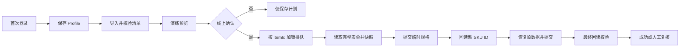

# Tmall SKU 批处理桌面工具 PRD

## 1. 文档信息

| 项目 | 内容 |
|---|---|
| 产品名称 | Tmall SKU Worker |
| 版本 | v0.1.8 |
| 目标平台 | Windows 10/11 |
| 产品形态 | Tauri 2 桌面应用，Vue 3 + TypeScript 控制台，Node.js + Playwright Worker |
| 需求状态 | v0.1.8 登录入口与 Worker 版本校验修复；纯接口线上重建适配器待测试商品验收 |

## 2. 背景与问题

商品规格的历史 SKU ID 可能被平台记录最低价。运营需要在保留原规格、价格、库存、商家编码、条码和图片的前提下，重建一组新的 SKU，并在几十个 SKU/多个商品上重复执行。纯手工操作耗时、容易漏填或误提交；直接复制浏览器 Cookie 又会造成凭据风险。

本产品使用系统 Edge 的应用专属 Profile 完成人工登录；登录阶段不附加 Playwright。登录完成后 Worker 才通过固定 CDP 端口连接同一有头浏览器，并使用共享登录态的 HTTP 请求上下文调用已验证的商品接口。任务期间不执行页面脚本、不修改页面状态、不触发按钮事件，也不刷新或导航页面。

> 当前交付包含可运行的 Tauri/Vue 控制台、Playwright Profile 生命周期、演练队列和 `tmall-publish-v2` 纯接口线上适配器。线上执行采用两次提交和两次回读，任何未知响应或字段不一致都会进入人工复核，不能把请求已发出等同于成功。

## 3. 用户与使用场景

### 3.1 目标用户

- 店铺运营：导入商品/SKU 清单，批量执行并处理失败项。
- 店铺负责人：查看每个商品的变更前后 ID 和回读证据，批准线上写入。
- 技术支持：在登录失效、验证码或接口契约变更时打开登录窗口并查看诊断日志。

### 3.2 典型场景

1. 用户首次打开应用，打开正常有头的专属 Edge，手工完成天猫登录和必要验证；此阶段不附加 Playwright。
2. 用户按行粘贴商品 ID，或导入兼容 CSV；应用按 `itemId` 分组，SKU 数量在读取商品快照后补全并校验。
3. 用户先运行演练，确认请求计划和结果；线上写入需要二次确认。
4. Worker 对每个商品串行执行“快照 -> 临时规格提交 -> 回读新 ID -> 恢复原数据提交 -> 最终回读”。
5. 用户在任务列表和审计详情中查看成功、失败和待人工复核项，可安全重试失败阶段。

## 4. 产品目标与成功指标

### 4.1 MVP 目标

- 以商品为原子任务，支持几十个 SKU 跨多个商品批量排队。
- 一次登录后可复用持久化 Profile，正常任务不显示浏览器窗口。
- API 优先完成 SKU 重建；不依赖“编辑规格/提交”按钮的模拟点击。
- 每次线上写入前有明确确认，提交后必须服务端回读并显示证据。
- 失败可定位到商品、阶段和接口响应，禁止不确定状态下自动重试写入。

### 4.2 成功指标（试运行）

- 100% 线上任务都有原始快照、请求摘要和最终回读记录。
- 正常网络下单商品端到端处理时间目标 25-60 秒，队列不发生同商品并发写入。
- 演练模式不产生线上写入；未确认的线上任务写入调用数为 0。
- 最终回读中规格文本、价格、库存、商家编码、条码、图片和 SKU 数量与预期一致，或被标记为人工复核。

## 5. 范围

### 5.1 MVP 包含

- Tauri 2 Windows 桌面壳和 Vue 控制台。
- 浏览器状态页：Profile、登录有效性、可见登录窗口、隐藏运行状态。
- 每行一个商品 ID 的批量粘贴、兼容 CSV、格式校验和按 `itemId` 分组预览。
- 演练模式（默认）和线上模式（显式确认、风险摘要、确认词）。
- 单 Worker 任务队列；演练任务可在安全边界暂停，线上任务启动后必须连续完成恢复与回读。
- 商品级两阶段 SKU 重建及提交后服务端回读。
- 任务状态、阶段日志、原始快照、结果快照、错误码和脱敏请求摘要写入本地持久化存储；v0.1 使用原子替换 JSON，启用线上适配器前迁移 SQLite。
- 失败项详情、人工复核标记、从最近安全阶段重试。

### 5.2 非目标

- 不支持多账号同时共享一个 Profile，不自动接管用户日常 Edge。
- 不绕过验证码、风控或登录保护；需要人工验证时暂停并提示。
- 不做商品标题、主图、详情装修、订单、营销投放、价格策略等非 SKU 领域。
- 不承诺只凭孤立 `skuId` 就能定位商品；推荐输入 `itemId + skuId`，反查属于后续能力。
- 不在 MVP 中提供多机器分布式并发、云端托管、Kubernetes 或公开 SaaS。

## 6. 核心流程



写入策略：同一账号一个 Worker；读取可预取，写入严格按 `itemId` 串行。任何提交超时、响应不明或回读不一致都进入人工复核，不盲目重复写入。

## 7. 功能需求

### FR-01 登录与浏览器

- 默认不读取或导出本机 Edge Cookie；使用应用专属持久化 Profile。
- 首次登录启动可见的系统 Edge 专属 Profile，用户点击“我已登录”后才执行 CDP 登录态检测。
- 登录成功后使用 Win32 隐藏同一有头 Edge 窗口，不关闭 Context、不重启浏览器、不切换 headless；前端显示“已登录/窗口已隐藏/需要人工验证”等状态。
- 检测到登录过期、验证码、二次确认或异常页面时，暂停写入并提供“打开登录窗口”。
- 同一 Profile 同时只允许一个 Worker 使用。

### FR-02 批量导入

默认输入为每行一个商品 ID，无需表头：

```text
828872681901
828872681902
```

同时兼容 CSV UTF-8（首行表头），字段如下：

| 字段 | 必填 | 说明 |
|---|---|---|
| `itemId` | 是 | 商品 ID，数字字符串 |
| `skuId` | 否 | 目标 SKU ID；用于导入前校验。省略时由 Worker 读取商品快照补全 |
| `mode` | 否 | `demo` 或 `live`，缺省为 `demo` |
| `expectedSkuCount` | 否 | 预期 SKU 数，用于防误操作校验 |

应用必须拒绝空 ID、重复商品和非数字行，并展示原始错误行号。只输入 `itemId` 时，界面显示 SKU 数“待读取”，不能显示为 0；Worker 必须在任何线上写入前读取完整商品快照并确定 SKU 数量。导入后用户可移除单行或整个商品。

### FR-03 预览与确认

- 预览展示商品数、SKU 总数、重复/缺失字段、预计耗时和风险。
- 演练模式只读取和生成计划，不调用线上写入接口。
- 线上模式默认关闭；用户必须勾选风险确认并输入确认词 `确认线上重建`，同时看到将处理的商品数和 SKU 数。
- 任务开始后锁定本批次输入快照，后续修改需新建批次。

### FR-04 任务队列

任务按 `itemId` 分组，状态如下：

```text
draft -> validated -> planned -> awaiting_confirmation -> queued
queued -> reading_snapshot -> temp_submitting -> temp_verified
temp_verified -> restoring -> final_verifying -> succeeded
演练阶段 -> paused / failed
线上可写阶段 -> needs_manual_review / failed
failed -> retry_eligible -> queued
```

- 每个商品显示当前阶段、开始/结束时间、尝试次数和最后错误。
- 暂停仅用于演练任务。线上任务启动后不接受暂停，避免商品停留在临时规格阶段。
- 同一批次最多一个活跃写入任务；未来可按账号扩展并发，但同 `itemId` 必须加锁。

### FR-05 SKU 重建与校验

- 读取完整商品表单作为不可变原始快照，保存原 SKU ID 与所有需恢复字段。
- 临时提交必须使用不会与原规格冲突的临时规格值/商家编码，并提交后回读确认出现新 SKU ID。
- 恢复提交必须使用原规格文本、规格身份、价格、库存、商家编码、条码、图片及其他未变字段，并保留新 SKU ID。
- 最终回读校验：SKU 数量、规格组合唯一性、价格、库存、outerId、barcode、图片关键字段与预期一致。
- 任一校验失败不得显示成功；生成差异报告并要求人工复核。

### FR-06 审计与日志

每个商品记录：批次 ID、itemId、原/新 SKU ID 映射、快照哈希、阶段时间、接口路径/HTTP 状态/业务错误码、回读差异和操作者。Cookie、Authorization、完整请求体中的敏感字段必须脱敏；日志支持导出 JSON（默认不含凭据）。

## 8. 安全、幂等与风控

- `demo` 是默认且唯一的无确认运行模式；线上写入必须通过 UI 二次确认和后端状态校验，不能仅由前端参数决定。
- 写入前保存快照和幂等键：`batchId + itemId + sourceSnapshotHash`。相同快照的已成功任务不得自动再次写入。
- 网络超时、浏览器崩溃、业务响应未知时标记 `needs_manual_review`，人工确认服务端状态后才可继续。
- 失败重试从最近已验证阶段开始，不能重复执行临时提交导致再次生成无主 SKU。
- Profile 存放在应用数据目录并限制本机用户访问；禁止提交 Git、上传云端或显示 Cookie。
- 仅允许天猫相关域名和配置的接口路径；请求方法、主机和业务字段做白名单校验。

## 9. UI 信息架构

- **总览**：登录状态、Worker 状态、批次统计、当前阶段。
- **批量导入**：CSV/粘贴、字段校验、商品分组预览、演练/线上模式。
- **任务队列**：按商品查看状态、进度、暂停/重试/人工复核。
- **任务详情**：原始/临时/最终 SKU 映射、字段差异、接口结果和时间线。
- **浏览器登录**：打开/关闭可见登录窗口，显示 Profile 与验证提示。
- **审计记录**：按批次、商品、结果筛选并导出脱敏记录。

所有页面需覆盖加载、空列表、校验错误、登录失效、接口错误和无权限状态；破坏性操作使用明确确认，不使用模拟按钮欺骗用户。

## 10. MVP 验收标准

- [ ] Windows 可安装并启动 Tauri 2 应用，控制台显示 Worker 健康状态。
- [x] 登录期间不附加 Playwright；验证后隐藏/恢复同一有头 Edge，Browser ID 不变且 `navigator.webdriver === false`。
- [x] 导入含多个商品、几十个 SKU 的 CSV，能正确分组、校验和预览。
- [x] 演练模式全流程可运行且线上写入调用数为 0。
- [x] 未输入确认词无法进入线上写入；确认内容与批次摘要不一致时仍被拒绝。
- [ ] 线上测试商品完成临时提交、回读新 ID、恢复原数据、最终回读四步，并显示字段差异为零。
- [x] 同一商品不会并发写入；暂停、崩溃和超时不会自动重复提交。
- [x] 失败任务可定位阶段和错误码，能人工复核后重试；审计导出不包含 Cookie/Token。

## 11. 版本计划

### MVP

单机单账号、一个 Worker、本地持久化、CSV 导入、演练/线上双模式、两阶段重建、回读校验、审计和可见登录窗口。

### 后续

- 多账号独立 Profile 与并行 Worker。
- SKU-only 反查 itemId、远程 API 编排和团队权限。
- 失败差异的修复建议、计划任务、数据库备份和更丰富报表。

## 12. 未决事项

- 天猫接口字段和业务校验可能变化，需以运行时抓取和回读为准；接口契约应版本化。
- 需持续验证 Edge/CDP 版本、窗口隐藏方式和企业安全软件兼容性。
- 线上模式的最终权限角色、确认词策略和审计保留周期由店铺负责人确认后冻结。
